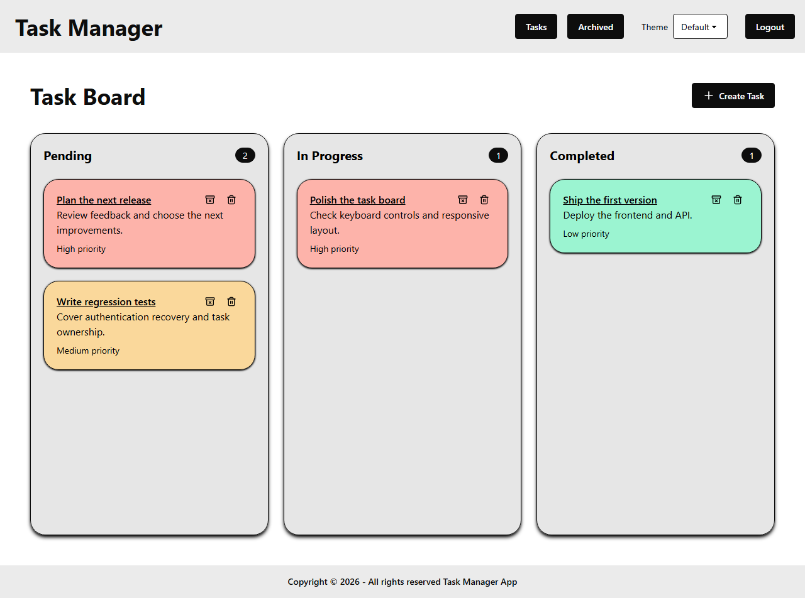

# Task Manager

[](https://github.com/felipev-gil/Task-Manager/actions/workflows/ci.yml)

A personal Kanban app built with React and Express: organize tasks, save their board order, and search an archive.

[Existing hosted demo](https://task-manager-felipev-gil.vercel.app/) — the hosted version may differ from this branch until deployment.
The API is hosted on Render; its readiness URL after this upgrade is /api/health.




## What this project demonstrates

- React hooks, Context, routing, forms, request cancellation, and optimistic updates with rollback.
- Cookie authentication, user-scoped MongoDB queries, body/query validation, and rate limiting.
- Persistent drag-and-drop ordering within and between workflow columns.
- Archive search, pagination, restore/delete actions, and accessible form labels.
- Isolated integration tests, frontend regression tests, browser checks, and GitHub Actions.

## Architecture and decisions

React pages → custom hooks → API services → Express routes/validators → controllers → Mongoose.
HTTP concerns stay in services and middleware; reusable UI behavior lives in hooks.

Each task query includes its owner ID. A compound MongoDB index supports user/archive/date filtering.
Archive search escapes regex syntax and limits query length; it is literal, case-insensitive substring search.
For larger datasets, use an appropriate search index rather than unbounded substring scans.

Board positions are stored as fractional numbers, so a move updates a single owned task.
The UI serializes moves and rolls back the affected task on failure. Legacy records receive stable virtual positions when listed.
Concurrent edits from separate browser tabs use last-write-wins; real-time collaboration, conflict resolution,
and rank compaction after extreme repeated insertions are future work. The active board currently loads all active tasks.
Priority is shown on cards; manual board order takes precedence over priority.

The tenets here are small, explicit modules and verified behavior. This is a portfolio application, not a claim of production certification.

## Requirements and setup

Use Node.js 24 and pnpm 11.19.0. From the repository root:

```sh
pnpm run setup
```

For a disposable local demonstration, run these in two terminals:

```sh
pnpm --dir backend demo
pnpm --dir frontend dev
```

Open http://localhost:5173. Sign in with **demo@example.test / PortfolioDemo123!**, or register a new account.
These credentials exist only in the disposable local demo. Its temporary MongoDB is removed when the process stops.
The first run downloads a MongoDB binary; subsequent runs reuse the cache. No Atlas or Upstash credentials are needed.

For normal development, copy `backend/.env.example` to `backend/.env` and
`frontend/.env.example` to `frontend/.env`, configure your own MongoDB URI and random JWT secret,
then run `pnpm --dir backend dev` and `pnpm --dir frontend dev`.
Generate a secret with `node -e "console.log(require('node:crypto').randomBytes(32).toString('hex'))"`.
The memory rate-limit store is development-only; production requires Upstash.

## Verification

```sh
pnpm lint
pnpm test
pnpm build
pnpm --dir backend test --runInBand --coverage
pnpm --dir frontend exec playwright install chromium
pnpm --dir frontend test:e2e
```

Backend tests create a temporary MongoDB and clean their records between tests. They do not use `MONGO_URI`, deployed data, or Upstash.
Frontend unit tests cover session expiry and retry recovery.
Browser tests start disposable local servers; ports 5000 and 5173 must be free.
CI repeats these checks and uploads coverage and browser reports. A passing local run does not imply a passing remote CI run.

## Security and deployment

Browser sessions use HTTP-only, SameSite=Lax cookies, secure in production, expiring after one day.
The browser never stores a JWT in localStorage. Existing localStorage tokens are removed, so users sign in again after this upgrade.
All mutating requests require an exact configured `Origin`, including sign-in and sign-out.
Passwords use bcrypt with a 72-byte input limit. A stolen cookie remains usable until expiry; immediate server-side revocation and password reset are future work.

Use a **same-origin /api reverse proxy** in production. Do not point the browser directly from a Vercel domain to a Render domain:
SameSite=Lax cookies intentionally do not support that cross-site setup.
Set `VITE_API_URL=/api`, `NODE_ENV=production`, `CORS_ORIGIN` to the exact frontend origin,
`RATE_LIMIT_STORE=upstash`, and configure MongoDB, a strong JWT secret, and both Upstash credentials.
Set `TRUST_PROXY` only to verified proxy hops or CIDRs for the actual deployment; an overly broad value enables spoofed IPs.
Health checks use `GET /api/health` and return 503 until MongoDB is connected.

[Deployment checklist](docs/DEPLOYMENT.md) · [API reference](docs/API.md) · [Contributing](CONTRIBUTING.md)

## License

[MIT](LICENSE)
