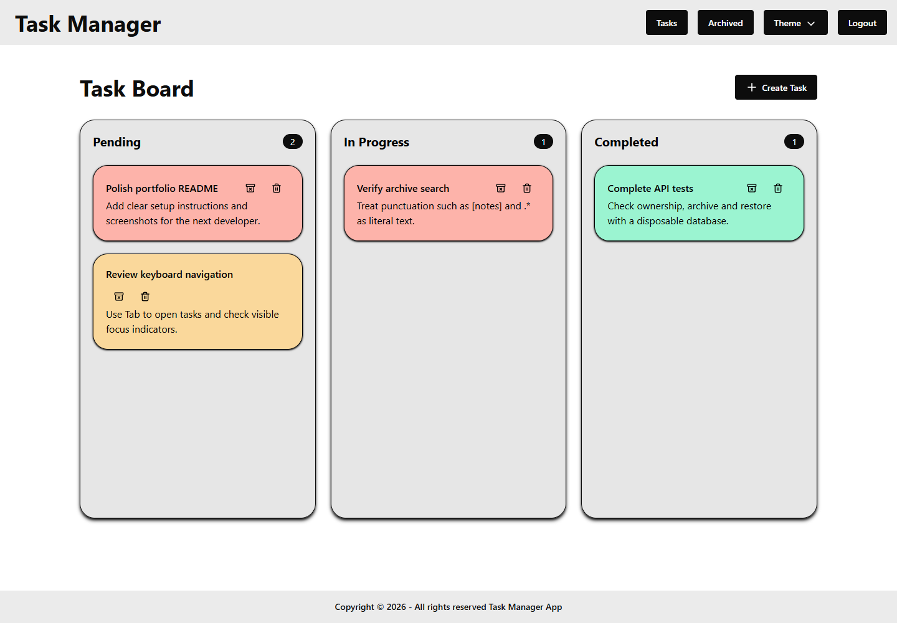
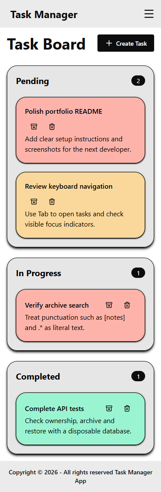
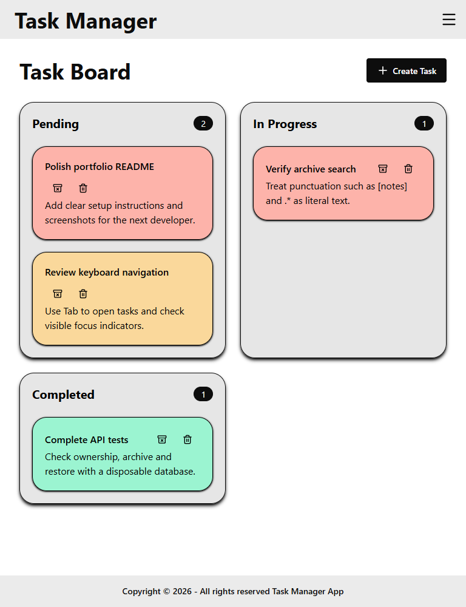
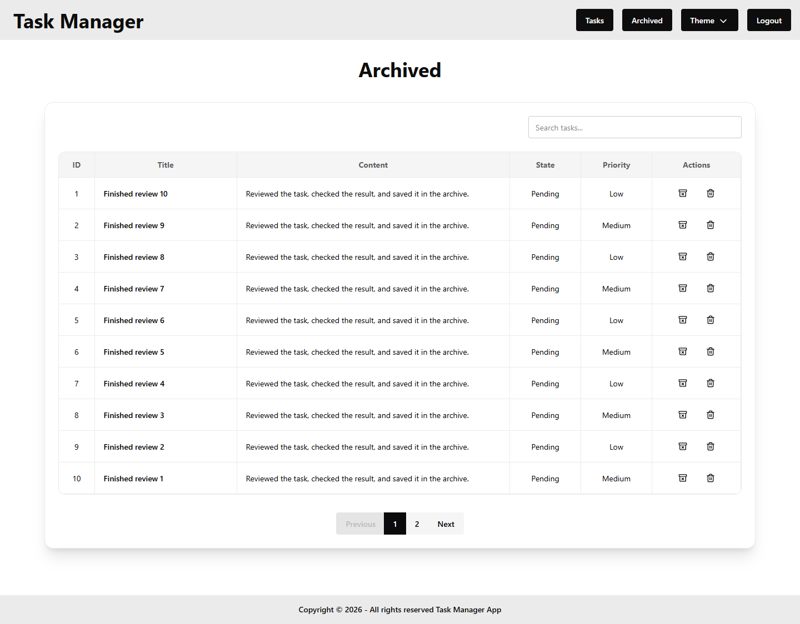

# Task Manager

A personal MERN task manager built as a junior developer portfolio project. Create tasks, move them through Pending → In Progress → Completed, and archive finished work.

## Demo

- [Open the app](https://task-manager-felipev-gil.vercel.app/)
- [Backend API](https://task-manager-pb69.onrender.com/api/tasks) — requires a bearer token; a 401 response without one is expected.

These are the existing deployment URLs. Screenshots below show the local polished version with fictional sample tasks; local changes must be deployed before they appear in the demo.

## Screenshots



<details>
<summary>Phone, tablet, and archive</summary>







</details>

## Features

- Register, sign in, and sign out using JWT authentication.
- Create, read, edit, and delete your own tasks. Titles allow 50 characters and content 300.
- Three status columns, with tasks sorted High → Medium → Low priority. Dragging changes status; manual order within a column is not saved.
- Open a task using its title link. Change status in the edit form, or use the drag handle with Space, arrow keys, and Space to drop (Escape cancels).
- Archive and restore tasks, with 10 items per page and case-insensitive literal title/content search (maximum 100 characters).
- Responsive board and forms, keyboard focus indicators, color-coded priority, and six existing themes. The archive table scrolls horizontally on smaller screens; focus it to scroll with a keyboard.
- Loading and saving feedback, retry actions for unavailable services, rate-limit messages, and rollback when a status move fails.

## Architecture

```text
React / Vite / React Router
  pages → custom hooks → Axios services
                    ↓ bearer JWT
Express → rate limiter → routes / authentication / validation
                    ↓ controllers
             Mongoose → MongoDB
```

Tailwind CSS and DaisyUI provide the styling. React state and the authentication context handle client state; there is no additional state-management library. The existing JWT is stored in localStorage and attached by Axios. Express authenticates the user and scopes task queries to that user's ID. Passwords are hashed with bcryptjs. Upstash provides the existing IP-based request limit.

Production hosting: frontend on Vercel, Express on Render, MongoDB on Atlas. Vite's API URL is embedded at build time.

## Local setup

Prerequisites: Node.js 24, pnpm 11 (the package manifests pin 11.1.1), a running MongoDB instance or your own Atlas development database, and your own Upstash Redis REST credentials. Never put backend secrets in a `VITE_` variable.

```sh
git clone https://github.com/felipev-gil/Task-Manager.git
cd Task-Manager
cd backend
pnpm install --frozen-lockfile
```

Copy `backend/.env.example` to `backend/.env` (`Copy-Item .env.example .env` in PowerShell, or `cp .env.example .env` in a Unix shell). Set:

| Variable | Purpose |
| --- | --- |
| `PORT` | API port; defaults to 5000 |
| `MONGO_URI` | Your development MongoDB connection string |
| `JWT_SECRET` | A long random secret; replace the example value |
| `CORS_ORIGIN` | Exact frontend origin, normally `http://localhost:5173` |
| `UPSTASH_REDIS_REST_URL` | Your Upstash REST endpoint |
| `UPSTASH_REDIS_REST_TOKEN` | Your Upstash REST token |

Start the backend:

```sh
pnpm run dev
```

In a second terminal, from the repository root:

```sh
cd frontend
pnpm install --frozen-lockfile
```

Copy `frontend/.env.example` to `frontend/.env`. Its default is `VITE_API_URL=http://localhost:5000/api`. Then:

```sh
pnpm run dev
```

Open [localhost:5173](http://localhost:5173), register your own account, and create a task. If you use `127.0.0.1` or a different frontend port, update `CORS_ORIGIN` to match. Restart the corresponding server after changing environment files.

## Checks and test safety

Backend tests need **no .env, Atlas database, or Upstash account**:

```sh
cd backend
pnpm install --frozen-lockfile
pnpm test --runInBand
```

Jest and Supertest exercise the actual routes against a disposable local MongoDB process created by `mongodb-memory-server`. Each suite gets its own process and `task_manager_test` database. The setup never reads `MONGO_URI`, cleans only that test connection's collections, and stops its process afterward. Do not replace this with the application's `connectDB()` helper. Upstash is mocked before app imports; ordinary tests never call it.

The first run downloads a MongoDB binary and can take longer (especially on Windows). Installation skips the package's postinstall download; the test run downloads on demand. Allow internet access to MongoDB's download host and execution of the temporary binary. If startup fails, resolve the download/OS permission issue; **do not point tests at an application database**.

The original authentication/task tests are retained. Focused tests cover required PATCH values, archive/restore, literal search, pagination after removing the last item, ownership on reads and updates, temporary authentication database failures, and mocked limiter failures.

Frontend checks:

```sh
cd frontend
pnpm run lint
pnpm run build
```

[GitHub Actions](.github/workflows/checks.yml) runs these checks and isolated backend tests on pushes and pull requests with no application secrets.

## Troubleshooting and deployment notes

- A temporary session failure keeps the token and offers **Try again**. **Back to sign in** explicitly clears it. A rejected/expired token requires signing in again.
- A failed task request displays a recovery message, not an empty-task message. For a 429 response, wait before retrying. The configured Upstash limit is 100 requests per minute per IP.
- Upstash outages return 503 under the existing fail-closed policy. Check the backend's REST credentials and service availability.
- The limiter runs before authentication, so it uses IP addresses. Its unreachable user-based branch was removed without changing ordering or `trust proxy`. The deployed forwarding chain could not be verified from this workspace. Before changing proxy trust, inspect `req.socket.remoteAddress`, `req.ip`, and forwarding headers in controlled deployment logs, compare independent clients, and verify spoofed headers are discarded. Follow the [Express proxy guide](https://expressjs.com/en/guide/behind-proxies/); do not blindly set `trust proxy: true`.
- Configure the same backend environment variables on Render. Set the deployed API URL in Vercel's `VITE_API_URL` and rebuild. Configure SPA fallback to `index.html` so `/tasks` and `/task/:id` work on reload.

## Learning focus

React hooks, accessible forms, REST validation, ownership checks, asynchronous failure recovery, and safe integration tests within a straightforward JavaScript MERN architecture.

## License

MIT
